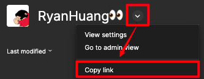

# Figma-latest-comments

本插件用于展示当前 figma 文件中最新的 10 条评论列表，展示格式如下：
```
{评论序号} {评论正文}
{评论链接}
```
简化向开发交付格式文本时的操作复杂度

## 如何获取 teamID

1. 获取 teamURL 
  
2. 从 teamURL 中结尾的数字即为 teamID

## 如何获取 Figma Token

1. 登录你的 figma 账号
2. 点击页面左上角「setting」菜单
3. 找到「Personal access tokens」区域
4. 点击「Generate new token」创建